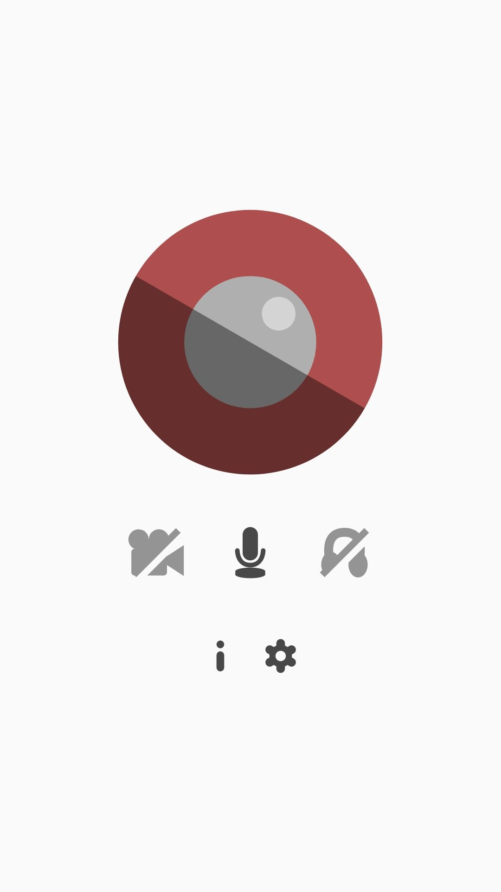
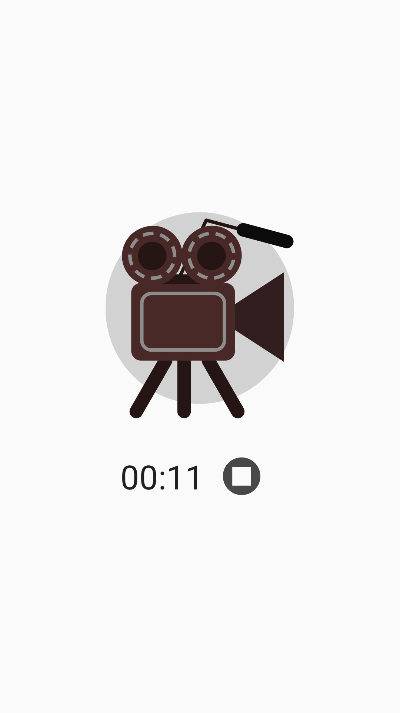

# DroidRec
***An open-source Android screen recorder.***

 

*Audio Playback recording requires Android 10 or later. No Root needed*

*(**WARNING**: Some device vendors may not allow recording certain Audio Playback sources, or even recording applications' audio at all)*

> Licensed under [The Unlicense](LICENSE)

Or download the apk from [the release section](https://github.com/egorolegovichyakovlev/DroidRec/releases)

## Building

To build this app, run:

`gradle assembleRelease`

To sign the build, first generate your keystore file:

`keytool -genkeypair -keystore signature.keystore -validity 365000 -keysize 4096 -keyalg RSA`

The signature file should be named **signature.keystore**

(**Note**: Run `keytool` from the same or older Java version on which you are going to build the application)

Then run **quicksign.bash** to sign the application. If Android SDK isn't defined in your path, specify the location of your `android-sdk/build-tools/VERSION` folder as an argument.

Example:

`./quicksign.bash $ANDROID_HOME/build-tools/34.0.0`

English | [עברית](README.he.md)
